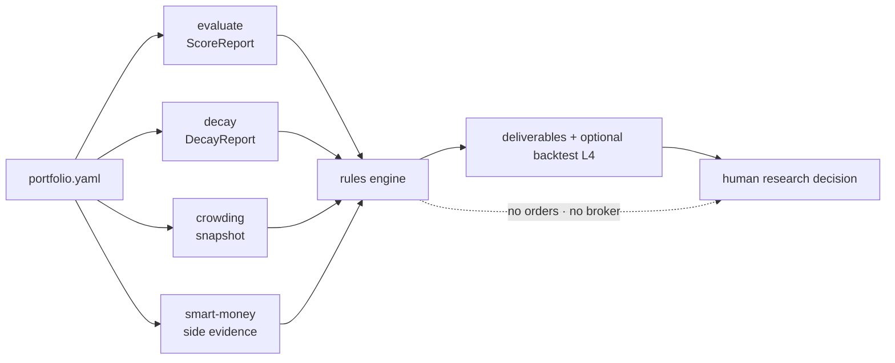

<h1 align="center">Alpha Portfolio Guardian Agent</h1>

<p align="center"><a href="README.md">简体中文</a> | <b>English</b></p>

<p align="center">Orchestrates factor evaluate/decay, crowding, and smart-money evidence into a reviewable portfolio health pack and guardian-rule effectiveness backtest.</p>

<p align="center">
  
  
  
  
  
</p>

> This is the QuantSkills community project `agent-alpha-portfolio-guardian`. It helps researchers and AI-agent workflows turn factor evaluate/decay, crowding monitors, and smart-money profiling into a **portfolio-level health report pack**. It places no orders, issues no unconditional buy/sell instructions, and makes no return promises. Until maintainer review, it does not claim official QuantSkills endorsement.

## What It Helps You Answer

> **In my current multi-factor book, which factors remain healthy, which look crowded or decaying, and which deserve watch / deweight / retire / rebuild research?**

## Workflow



## When To Use It

- You want a weekly/daily health check across a factor book.
- You need evaluate, decay, crowding, and smart-money evidence in one handoff pack.
- You want descriptive effectiveness stats for the guardian rules.
- You want the same Agent rules loaded in Claude Code / Codex / Cursor / Hermes / OpenClaw.

## Deliverables

Research runs write to `reports/runtime_out/`; backtests write to `reports/backtest/`:

| Deliverable | Content | Form |
| --- | --- | --- |
| Health matrix | Score / half-life / signal / reasons | CSV / Parquet |
| Crowding alerts | Heat warnings attached to exposures | JSON |
| Retire / rebuild list | Action + reason codes + next step | CSV |
| IC decay curves | Family chart + curve JSON | PNG / JSON |
| Effectiveness L4 | Buckets / accuracy / equity / rolling OOS | `l4.html` |

Samples: [`reports/samples/mock_run/`](reports/samples/mock_run/), [`reports/samples/backtest_mock/l4.html`](reports/samples/backtest_mock/l4.html).

## Directory Layout

```text
agent-alpha-portfolio-guardian/
├── AGENTS.md                 Agent declaration + behavior entry (required)
├── README.md / README.en.md  Repository homepage
├── LICENSE                   GPL-3.0-only
├── 用户使用手册.md            Configuration guide (Chinese)
├── agents/                   Cursor / OpenAI / portable loader / publish manifest
├── runtime/                  Unified CLI and orchestration
├── scripts/                  Bridges, validation, backtest, L4 export
├── templates/                Report and backtest L4 templates
├── references/               Rules, contracts, boundaries
├── config/                   Portfolio examples
├── reports/samples/          Structure samples
└── requirements.txt
```

## Quick Start

**Option 1: read the sample** — open `reports/samples/mock_run/runtime_report.md` and `reports/samples/backtest_mock/l4.html`.

**Option 2: trigger inside an AI agent**

```text
Run alpha-portfolio-guardian on the current multi-factor book;
read attached ScoreReport / DecayReport artifacts, degrade on gaps, do not invent numbers.
```

**Option 3: local CLI**

```powershell
py -3.10 -m pip install -r requirements.txt
# set PANDA_DATA_USERNAME / PANDA_DATA_PASSWORD when live online fetch is needed (never commit secrets)

python -m runtime self-test
python -m runtime --mock
python -m runtime --portfolio config/portfolio.yaml --live
python -m runtime backtest --allow-simulate
python -m runtime clean
```

Dependencies: `skill-factor-evaluate`, `skill-factor-decay`, `agent-crowding-risk-monitor`, `skill-smart-money-profiler`.

## Runtime Compatibility

[`AGENTS.md`](AGENTS.md) is the sole QuantSkills Agent declaration and behavior entry. Loadable in **Claude Code, Codex, Cursor, Hermes, and OpenClaw**:

| Runtime | Entry |
| --- | --- |
| Claude Code / Codex | Load this folder's `AGENTS.md` + four dependencies |
| Cursor | `.cursor/skills/agent-alpha-portfolio-guardian` + `agents/cursor-rule.mdc` |
| Hermes / OpenClaw | `agents/portable-loader.md` |
| OpenAI-compatible | `agents/openai.yaml` |

Publish metadata: [`agents/skill-manifest.yaml`](agents/skill-manifest.yaml).

## Data Sources And Assumptions

- Formal data origin: Pandadata (via dependency Skills or provenance-tagged cache artifacts).
- Factors in one run must share the same `universe` and `horizon_eval`.
- Thresholds and reason codes: `config/portfolio*.yaml` and `references/decision-rules.md`.
- Backtest accepts metrics/fwd panels; `--allow-simulate` is for method self-test only.

## Limitations And Risk Boundaries

- Research and education only; validates no return claims and is not investment advice.
- Gaps must be labeled as degraded / insufficient — do not fabricate numbers.
- No deterministic trading orders (buy / sell / must-rise / raise position to xx%).
- No broker connectivity and no order execution.
- Not an `alpha-*` production factor package; trading-link delivery needs a separate Alpha process.
- This repository is a Community Project; listing or official recognition still requires maintainer review.

## Reference Documents

- [`AGENTS.md`](AGENTS.md) — declaration, behavior, scenarios, limits, metadata
- [`用户使用手册.md`](用户使用手册.md) — configuration guide
- [`references/`](references/) — rules, contracts, boundaries

## Maintainer

Created or maintained by `frocir`.

## License

GNU General Public License v3.0 only (`GPL-3.0-only`). See [LICENSE](LICENSE).

## 🐼 PandaAI / QUANTSKILLS Community

<div align="center">
  
  <br>
  <sub>Scan to join the PandaAI community for QUANTSKILLS skills, agent workflows, and quant research practice.</sub>
</div>
