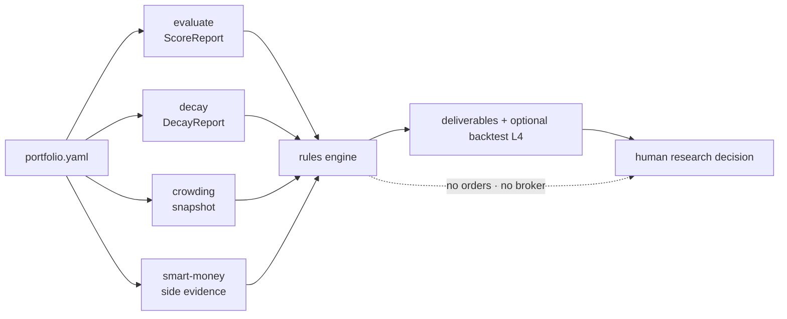

<h1 align="center">Alpha Portfolio Guardian Agent</h1>

<p align="center"><a href="README.md">简体中文</a> | <b>English</b></p>

<p align="center">Orchestrates factor evaluate/decay, crowding, and smart-money evidence into a reviewable portfolio health pack and guardian-rule effectiveness backtest.</p>

<p align="center">
  
  
  
  
  
</p>

> This is the QuantSkills community project `agent-alpha-portfolio-guardian`. It helps researchers and AI-agent workflows turn factor evaluate/decay, crowding monitors, and smart-money profiling into a **portfolio-level health report pack**. It places no orders, issues no unconditional buy/sell instructions, and makes no return promises. Until maintainer review, it does not claim official QuantSkills endorsement.

## What It Helps You Answer

> **In my current multi-factor book, which factors remain healthy, which look crowded or decaying, and which deserve watch / deweight / retire / rebuild research?**

| Question | Output |
|----------|--------|
| Healthy vs decaying? | Health matrix |
| Crowding / stampede risk? | Crowding alerts |
| Watch / deweight / retire / rebuild? | Candidate list |
| How long do signals last? | IC decay curves |
| Are the guardian rules historically sensible? | Effectiveness backtest L4 |

Behavior entry: [`AGENTS.md`](AGENTS.md). Rules: [`references/decision-rules.md`](references/decision-rules.md). Full Chinese how-to lives in [`README.md`](README.md).

## What It Does Not Do

- No orders; no “buy / sell / must-rise / raise position to xx%”
- Not an `alpha-*` production factor package
- Does not invent numbers when dependencies fail
- Does not replace `skill-factor-evaluate` / `skill-factor-decay` computation

## Workflow



## Quick Start

**Option 1: samples** — `reports/samples/mock_run/runtime_report.md`, `reports/samples/backtest_mock/l4.html`.

**Option 2: agent prompt**

```text
Run alpha-portfolio-guardian on the current multi-factor book;
read attached ScoreReport / DecayReport artifacts, degrade on gaps, do not invent numbers.
```

**Option 3: local CLI**

```powershell
py -3.10 -m pip install -r requirements.txt
# set PANDA_DATA_* when live online fetch is needed (never commit secrets)

python -m runtime self-test
python -m runtime --mock
Copy-Item config\portfolio.example.yaml config\portfolio.yaml
python -m runtime --portfolio config/portfolio.yaml --live
python -m runtime backtest --allow-simulate
```

Dependencies: `skill-factor-evaluate`, `skill-factor-decay`, `agent-crowding-risk-monitor`, `skill-smart-money-profiler`.

## Configuration & Commands

Copy `config/portfolio.example.yaml` → `portfolio.yaml`. Key fields: `as_of`, `as_of_calendar.mode` (`off|soft|hard`), `universe`, `horizon_eval`, `source_mode`, `factors[]` (`score_report_path` / `decay_report_path` / `exposure_symbols`), `crowding`, `smart_money`, `thresholds`.

| Command | Purpose |
|---------|---------|
| `python -m runtime --live` | Formal research run |
| `python -m runtime --mock` / `self-test` | Offline smoke |
| `python -m runtime validate` / `publish` | Gate & publish |
| `python -m runtime backtest --from-panel-store` | Live panel ledger |
| `python -m runtime backtest --metrics-panel …` | User panels |
| `python -m runtime backtest --allow-simulate` | Simulated method test |

Backtest requires **exactly one** source. Only **live/degraded** runs append to `data/panels/`.

## Reading Outputs

Research pack: `reports/runtime_out/<run_id>/` (`runtime_report.md`, `health_matrix.csv`, alerts, candidates, IC curves, `agent_snapshot.json`).  
Publish: `reports/publish/<as_of>/<data_version>/`.  
Backtest: `reports/backtest/<run_id>/` + `l4.html`. Signals: `keep` / `watch` / `deweight` / `retire_candidate` / `rebuild_candidate` / `insufficient`.

## Directory Layout

```text
agent-alpha-portfolio-guardian/
├── AGENTS.md / README.md / README.en.md / LICENSE
├── agents/ runtime/ scripts/ templates/ references/ config/
├── data/panels/              live metrics ledger (data gitignored)
├── reports/samples/          structure samples
└── requirements.txt
```

## Runtime Compatibility

[`AGENTS.md`](AGENTS.md) is the sole behavior entry for Claude Code, Codex, Cursor, Hermes, and OpenClaw. See `agents/` for adapters.

## Limitations

Research/education only; Pandadata origin; no fabrication; no broker orders; not an `alpha-*` production package; Community Project pending maintainer review for official listing.

## Reference Documents

- [`AGENTS.md`](AGENTS.md) — declaration & behavior
- [`README.md`](README.md) — full Chinese usage guide
- [`references/`](references/) — rules, contracts, data guide
- [`config/portfolio.example.yaml`](config/portfolio.example.yaml)

## Maintainer

Created or maintained by `frocir`.

## License

GNU General Public License v3.0 only (`GPL-3.0-only`). See [LICENSE](LICENSE).

## 🐼 PandaAI / QUANTSKILLS Community

<div align="center">
  
  <br>
  <sub>Scan to join the PandaAI community for QUANTSKILLS skills, agent workflows, and quant research practice.</sub>
</div>
