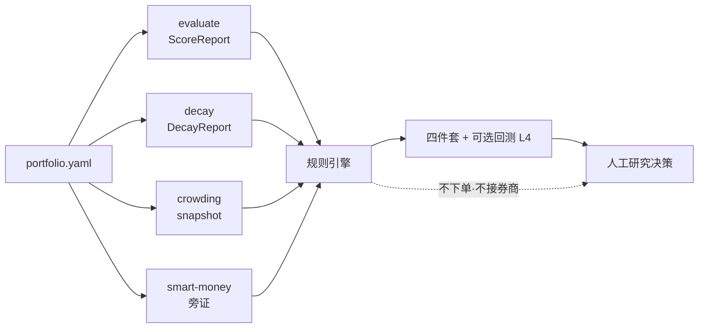

<h1 align="center">Alpha 多因子组合健康度守卫 Agent</h1>

<p align="center"><b>简体中文</b> | <a href="README.en.md">English</a></p>

<p align="center">聚合单因子体检、衰减、拥挤与聪明钱旁证，输出可复盘的组合健康度四件套与守卫规则有效性回测。</p>

<p align="center">
  
  
  
  
  
</p>

> 这是 QuantSkills 社区项目 `agent-alpha-portfolio-guardian`：面向研究员与 AI Agent 编排场景，把 factor evaluate / decay、拥挤盯盘与聪明钱画像整理成 **组合级健康度报告包**。不自动下单，不输出无条件买卖指令，也不承诺收益。未经维护者审核前，不代表 QuantSkills 官方背书。

## 它帮你回答什么

> **当前多因子组合里，哪些因子仍健康，哪些过热或衰减，哪些应进入观察 / 降权 / 退休 / 重构研究？**

## 工作流



## 你什么时候会用它

- 需要周度 / 日度检查因子库健康度，筛退休与重构对象。
- 要把 evaluate、decay、拥挤、聪明钱旁证编成一份可交接报告。
- 希望检验守卫规则在历史上的分桶与准确率特征。
- 希望在 Claude Code / Codex / Cursor / Hermes / OpenClaw 中加载同一套 Agent 规则。

## 产出一览

研究态默认写入 `reports/runtime_out/`；回测写入 `reports/backtest/`：

| 产出 | 内容 | 形式 |
| --- | --- | --- |
| 健康度矩阵 | 主分 / 半衰期 / signal / 原因 | CSV / Parquet |
| 拥挤警示 | 挂到因子暴露上的过热提示 | JSON |
| 退休 / 重构候选 | 动作 + 原因码 + 建议下一步 | CSV |
| IC 衰减曲线 | 族图 + 曲线 JSON | PNG / JSON |
| 有效性回测 L4 | 分桶 / 准确率 / 净值 / 滚动窗 | `l4.html` |

结构样例：[`reports/samples/mock_run/`](reports/samples/mock_run/)、[`reports/samples/backtest_mock/l4.html`](reports/samples/backtest_mock/l4.html)。

## 目录结构

```text
agent-alpha-portfolio-guardian/
├── AGENTS.md                 Agent 声明与多运行时入口（QuantSkills 必填）
├── SKILL.md                  完整行为与使用说明
├── README.md / README.en.md  仓库主页
├── LICENSE                   GPL-3.0-only
├── 用户使用手册.md            配置与读报告
├── agents/                   Cursor / OpenAI / portable loader / 发布清单
├── runtime/                  统一 CLI 与编排
├── scripts/                  桥接、校验、回测、L4 导出
├── templates/                报告与回测 L4 模板
├── references/               规则、契约、边界
├── config/                   portfolio 样例
├── reports/samples/          结构样例
└── requirements.txt
```

## 快速开始

**方式一：读样例** —— 打开 `reports/samples/mock_run/runtime_report.md` 与 `reports/samples/backtest_mock/l4.html`。

**方式二：在 AI Agent 里触发**

```text
用 alpha-portfolio-guardian 对当前多因子组合做健康度守卫；
读取已挂好的 ScoreReport / DecayReport，缺口标注降级，不要编造数值。
```

**方式三：本机 CLI**

```powershell
py -3.10 -m pip install -r requirements.txt
# 在环境变量中设置 PANDA_DATA_USERNAME / PANDA_DATA_PASSWORD（live 且需在线取数时；勿提交密钥）

python -m runtime self-test
python -m runtime --mock
python -m runtime --portfolio config/portfolio.yaml --live
python -m runtime backtest --allow-simulate
python -m runtime clean
```

依赖：`skill-factor-evaluate`、`skill-factor-decay`、`agent-crowding-risk-monitor`、`skill-smart-money-profiler`。

## 运行时兼容

本仓库以 [`AGENTS.md`](AGENTS.md) 为 QuantSkills Agent 声明入口，详细行为见 [`SKILL.md`](SKILL.md)，可在 **Claude Code、Codex、Cursor、Hermes、OpenClaw** 等运行时中加载：

| 运行时 | 入口 |
| --- | --- |
| Claude Code / Codex | 加载本目录 + 四依赖 |
| Cursor | `.cursor/skills/agent-alpha-portfolio-guardian` + `agents/cursor-rule.mdc` |
| Hermes / OpenClaw | `agents/portable-loader.md` |
| OpenAI 兼容 | `agents/openai.yaml` |

发布元数据：[`agents/skill-manifest.yaml`](agents/skill-manifest.yaml)。

## 数据来源与假设

- 正式数据源：Pandadata（经依赖 Skill 或其带溯源的缓存产物）。
- 组合内因子须同一 `universe` 与 `horizon_eval`，保证主分可比。
- 阈值与原因码见 `config/portfolio*.yaml` 与 `references/decision-rules.md`。
- 回测可用历史 metrics/fwd 面板；`--allow-simulate` 仅用于方法自测。

## 限制与风险边界

- 仅供研究与教育参考；不验证任何收益声明，不构成投资建议。
- 数据 / 依赖缺口必须标注降级，禁止用假设填补。
- 禁止确定性下单指令（买入 / 卖出 / 必涨 / 仓位提到 xx%）。
- 不接券商接口、不执行订单、不替用户做最终交易决定。
- 不是 `alpha-*` 生产因子包；进入交易链路须另按 Alpha 生产规则交付。
- 本仓库为 Community Project；收录、推荐或官方认可仍需维护者审核。

## 参考文档

- [`AGENTS.md`](AGENTS.md) — 项目声明、场景、限制与元数据
- [`SKILL.md`](SKILL.md) — 行为入口与工作流
- [`用户使用手册.md`](用户使用手册.md) — 配置与读报告
- [`references/`](references/) — 规则、契约、边界

## 维护者

Created or maintained by `frocir`.

## License

GNU General Public License v3.0 only（`GPL-3.0-only`）。详见 [LICENSE](LICENSE)。

## 🐼 PandaAI / QUANTSKILLS 社群

<div align="center">
  
  <br>
  <sub>扫码加入 PandaAI 社群，交流 QUANTSKILLS 技能、Agent 工作流与量化研究实践。</sub>
</div>
