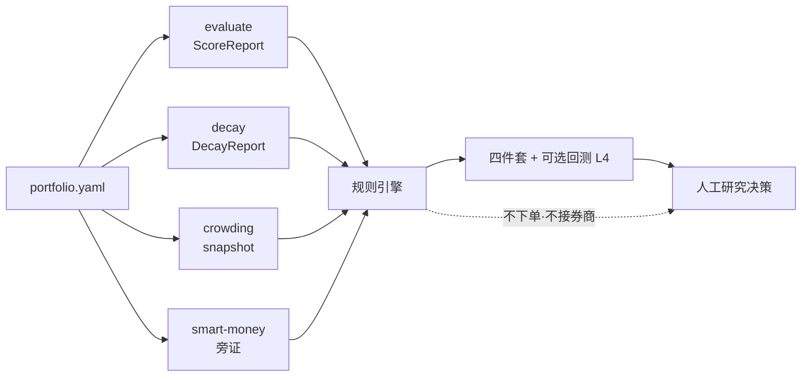

<h1 align="center">Alpha 多因子组合健康度守卫 Agent</h1>

<p align="center"><b>简体中文</b> | <a href="README.en.md">English</a></p>

<p align="center">聚合单因子体检、衰减、拥挤与聪明钱旁证，输出可复盘的组合健康度四件套与守卫规则有效性回测。</p>

<p align="center">
  
  
  
  
  
</p>

> 这是 QuantSkills 社区项目 `agent-alpha-portfolio-guardian`：面向研究员与 AI Agent 编排场景，把 factor evaluate / decay、拥挤盯盘与聪明钱画像整理成 **组合级健康度报告包**。不自动下单，不输出无条件买卖指令，也不承诺收益。未经维护者审核前，不代表 QuantSkills 官方背书。

## 它帮你回答什么

> **当前多因子组合里，哪些因子仍健康，哪些过热或衰减，哪些应进入观察 / 降权 / 退休 / 重构研究？**

| 问题 | 产出 |
|------|------|
| 哪些还健康、哪些在衰减？ | 因子健康度矩阵 |
| 有没有过热/踩踏风险？ | 拥挤度警示 |
| 该观察、降权、重构还是移出？ | 退休 / 重构 / 降权候选清单 |
| 信号还能用多久？ | IC 衰减曲线 |
| 守卫规则历史上靠不靠谱？ | 有效性回测 L4 |

行为入口：[`AGENTS.md`](AGENTS.md)。规则细节：[`references/decision-rules.md`](references/decision-rules.md)。

## 不能做什么

- 不下单，不输出「买入 / 卖出 / 必涨 / 仓位提到 xx%」
- 不是 `alpha-*` 生产因子包
- 依赖失败时不编造完整数值
- 不替代 `skill-factor-evaluate` / `skill-factor-decay` 的主分与衰减计算

## 工作流



## 快速开始

**方式一：读样例** — `reports/samples/mock_run/runtime_report.md`、`health_matrix.csv`；回测页 `reports/samples/backtest_mock/l4.html`。

**方式二：对话触发**

```text
用 alpha-portfolio-guardian 对当前多因子组合做健康度守卫；
读取已挂好的 ScoreReport / DecayReport，缺口标注降级，不要编造数值。
```

**方式三：本机 CLI**

```powershell
py -3.10 -m pip install -r requirements.txt
# live 且需在线取数时设置 PANDA_DATA_USERNAME / PANDA_DATA_PASSWORD（勿提交密钥）

python -m runtime self-test
python -m runtime --mock
Copy-Item config\portfolio.example.yaml config\portfolio.yaml
python -m runtime --portfolio config/portfolio.yaml --live
python -m runtime backtest --allow-simulate
python -m runtime clean
```

同级建议具备：`skill-factor-evaluate`、`skill-factor-decay`、`agent-crowding-risk-monitor`、`skill-smart-money-profiler`。已有带 Pandadata 溯源的依赖产物时，本 Agent 可不持有凭证。

## 配置组合

```powershell
Copy-Item config\portfolio.example.yaml config\portfolio.yaml
```

| 字段 | 含义 |
|------|------|
| `as_of` | 结论锚定日；`null` = 运行日 |
| `as_of_calendar` | `mode`=`off\|soft\|hard`，`exchange`，`snap_to_prev` |
| `universe` / `horizon_eval` | 组合内须一致 |
| `source_mode` | `live` / `mock` / `degraded` |
| `data_source` | 正式运行填 `Pandadata` |
| `factors[]` | 见下 |
| `crowding` / `smart_money` | 桥接路径与开关 |
| `thresholds` / `rules_version` | 规则阈值与版本 |

```yaml
factors:
  - factor_id: F001
    name: momentum_20
    score_report_path: deps/F001_score.json    # 推荐
    decay_report_path: deps/F001_decay.json
    exposure_symbols: ["600519.SH"]
```

优先级：显式报告路径 → 信号旁路 `*_score.json` / `*_decay.json` → mock 合成（仅自测）。

## 命令一览

| 命令 | 作用 |
|------|------|
| `python -m runtime --mock` | mock 全链路 |
| `python -m runtime --portfolio config/portfolio.yaml --live` | 正式研究态 |
| `python -m runtime self-test` | 单测 + 样例刷新 |
| `python -m runtime validate <run_dir>` | 校验产物 |
| `python -m runtime publish --from <run_dir>` | 写发布快照 |
| `python -m runtime backtest --from-panel-store` | 用 live 累积面板回测 |
| `python -m runtime backtest --metrics-panel a.csv [--fwd-panel b.csv]` | 历史面板回测 |
| `python -m runtime backtest --allow-simulate` | 模拟回测（自测） |
| `python -m runtime clean` | 清理 `reports/runtime_out/` |

回测必须三选一（禁止静默猜源）。仅 **live/degraded** 会把 `health_matrix` 追加到 `data/panels/`；mock 不入库。无 `--fwd-panel` 时默认用下一期 `rank_ic` 近似后验。

推荐流程：准备 evaluate/decay（及可选 crowding / smart-money）→ 填 `portfolio.yaml` → `--live` → 读报告 → `validate` → 可选 `publish` / `backtest`。

## 如何读产出

研究态：`reports/runtime_out/<run_id>/`

| 文件 | 用途 |
|------|------|
| `runtime_report.md` | 主报告 |
| `health_matrix.csv` | 健康度表 |
| `crowding_alerts.json` | 拥挤警示 |
| `retire_rebuild_candidates.csv` | 动作候选 |
| `ic_decay_curves.json` + `charts/` | 衰减曲线 |
| `agent_snapshot.json` / `handoff_card.md` | 下游交接 |
| `run_summary.json` / `validation.json` | 摘要与门禁 |
| `deps/` | 依赖产物索引 |

常见 `signal`：`keep` / `watch` / `deweight` / `retire_candidate` / `rebuild_candidate` / `insufficient`（看 `gap_notes`）。原因码见 [`references/decision-rules.md`](references/decision-rules.md)。

发布：`python -m runtime publish --from ...` → `reports/publish/<as_of>/<data_version>/`。

回测：`reports/backtest/<run_id>/`（`l4.html`、`backtest_report.md`、`bucket_stats.csv`、`accuracy.json` 等）。也可 `python scripts/export_l4_backtest.py --run-dir ...`。这是守卫规则有效性，不是 Alpha 生产全套 IC 回测。

## 产出一览

| 产出 | 内容 | 形式 |
| --- | --- | --- |
| 健康度矩阵 | 主分 / 半衰期 / signal / 原因 | CSV / Parquet |
| 拥挤警示 | 挂到因子暴露上的过热提示 | JSON |
| 退休 / 重构候选 | 动作 + 原因码 + 建议下一步 | CSV |
| IC 衰减曲线 | 族图 + 曲线 JSON | PNG / JSON |
| 有效性回测 L4 | 分桶 / 准确率 / 净值 / 滚动窗 | `l4.html` |

结构样例：[`reports/samples/mock_run/`](reports/samples/mock_run/)、[`reports/samples/backtest_mock/l4.html`](reports/samples/backtest_mock/l4.html)。

## 目录结构

```text
agent-alpha-portfolio-guardian/
├── AGENTS.md                 Agent 声明 + 行为入口
├── README.md / README.en.md  仓库主页（含使用说明）
├── LICENSE                   GPL-3.0-only
├── agents/                   Cursor / OpenAI / portable loader
├── runtime/                  统一 CLI 与编排
├── scripts/                  桥接、校验、回测、L4
├── templates/                报告与回测 L4 模板
├── references/               规则、契约、边界
├── config/                   portfolio 样例
├── data/panels/              live 历史面板账本（gitignore 数据）
├── reports/samples/          结构样例
└── requirements.txt
```

## 运行时兼容

以 [`AGENTS.md`](AGENTS.md) 为唯一 Agent 声明与行为入口：

| 运行时 | 入口 |
| --- | --- |
| Claude Code / Codex | 本目录 `AGENTS.md` + 四依赖 |
| Cursor | `.cursor/skills/...` + `agents/cursor-rule.mdc` |
| Hermes / OpenClaw | `agents/portable-loader.md` |
| OpenAI 兼容 | `agents/openai.yaml` |

## 常见问题

- **live 一跑就失败**：需 `data_source: Pandadata`，且有带溯源的依赖产物；既无产物又要在线取数则配凭证。
- **矩阵全是 `insufficient`**：缺少 ScoreReport/DecayReport，先跑依赖或写好路径。
- **mock vs live**：mock 仅流程自测；正式结论用 live/degraded，版本前缀不同勿混用。
- **回测真实数据**：用 `--metrics-panel` / `--fwd-panel`，或累积后 `--from-panel-store`。
- **无图**：看 `charts/ic_decay_family.png`，否则有 ASCII 降级。

## 数据来源与限制

- 正式数据源：Pandadata（经依赖 Skill 或带溯源缓存）。
- 组合内因子须同一 `universe` 与 `horizon_eval`。
- 仅供研究参考；禁止编造；不接券商、不下单。
- 不是 `alpha-*` 生产包；Community Project，官方收录需维护者审核。

## 参考文档

- [`AGENTS.md`](AGENTS.md) — 行为入口、场景、限制与元数据
- [`references/`](references/) — 规则、契约、数据指南、边界
- [`config/portfolio.example.yaml`](config/portfolio.example.yaml) — 配置样例
- [`data/panels/README.md`](data/panels/README.md) — 历史面板账本

## 维护者

Created or maintained by `frocir`.

## License

GNU General Public License v3.0 only（`GPL-3.0-only`）。详见 [LICENSE](LICENSE)。

## 🐼 PandaAI / QUANTSKILLS 社群

<div align="center">
  
  <br>
  <sub>扫码加入 PandaAI 社群，交流 QUANTSKILLS 技能、Agent 工作流与量化研究实践。</sub>
</div>
